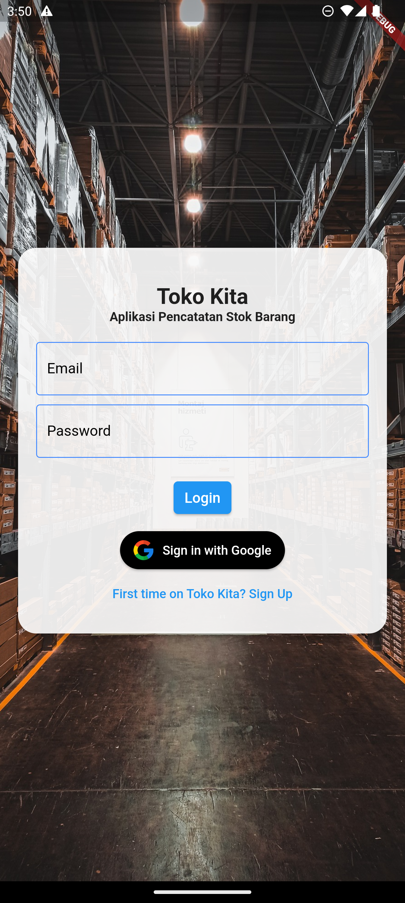
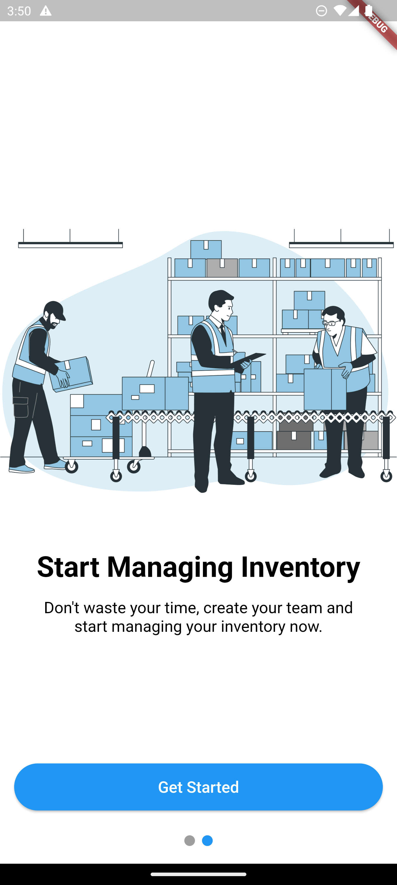
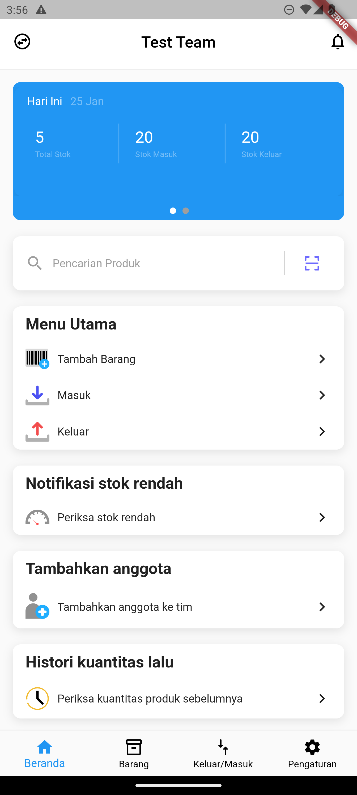
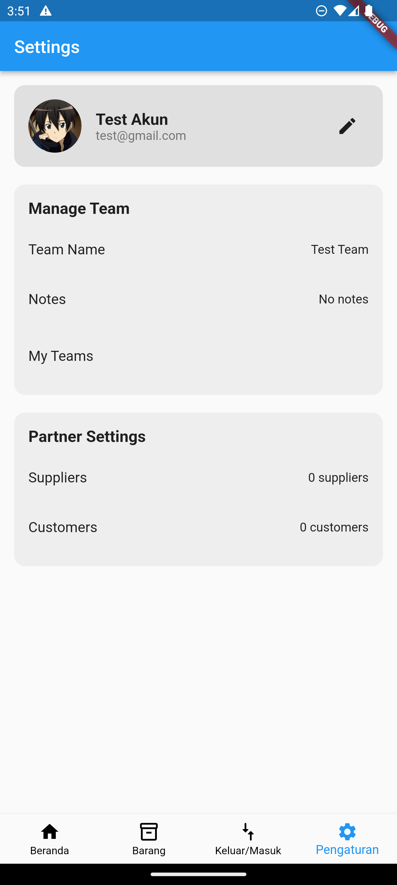
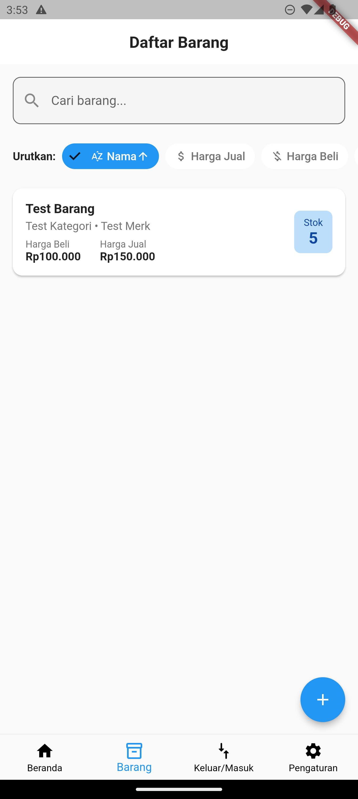
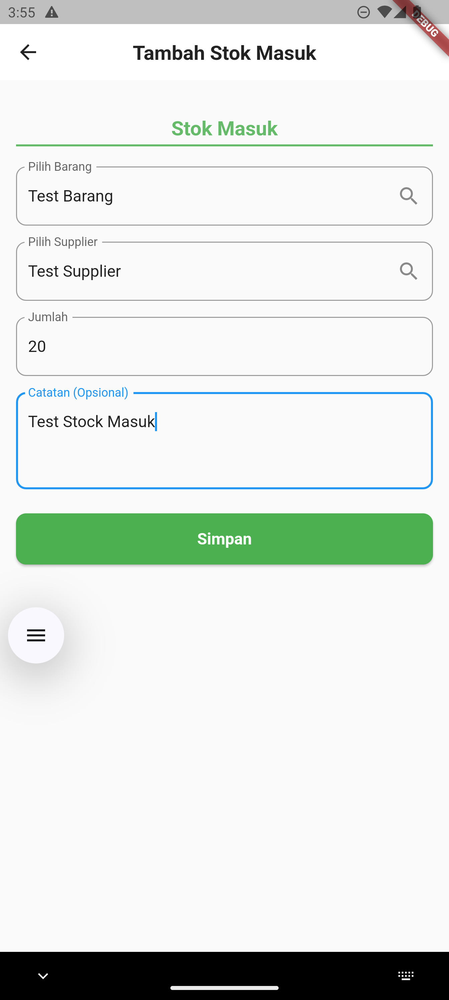
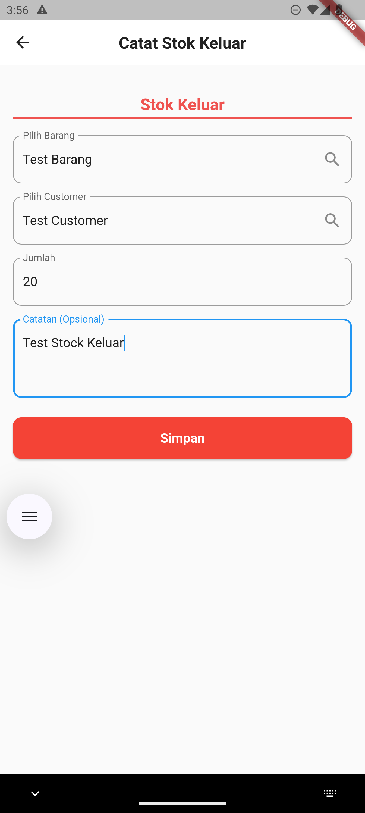
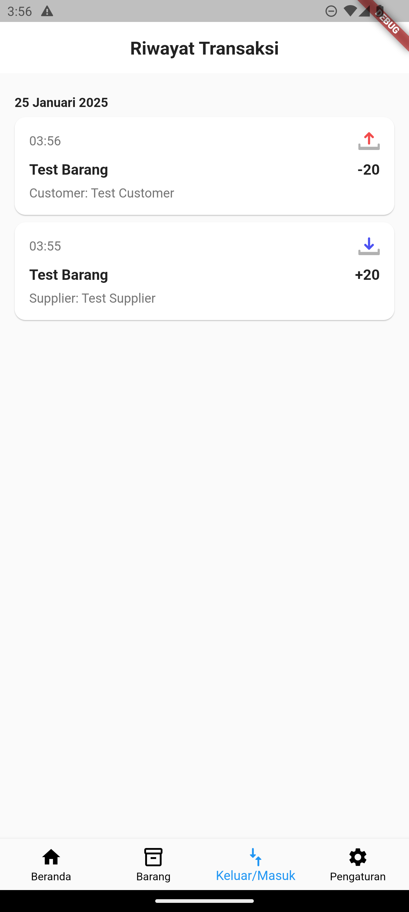
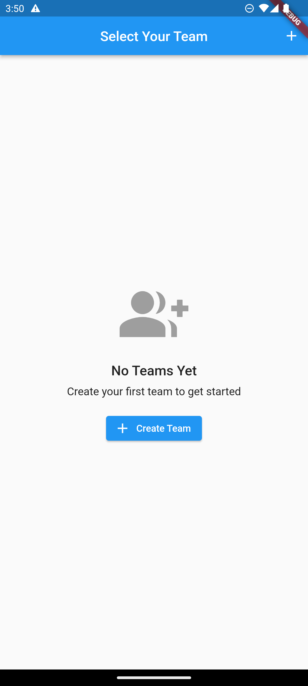

# Toko Kita - Inventory Management System

Toko Kita adalah aplikasi manajemen inventori yang dikembangkan menggunakan Flutter. Aplikasi ini membantu pemilik bisnis untuk mengelola stok barang, transaksi, dan laporan dengan lebih efisien.

## Fitur

- 📦 Manajemen Produk
  - Tambah, edit, dan hapus produk
  - Tracking stok realtime
  - Kategorisasi produk

- 🛍️ Manajemen Transaksi
  - Pencatatan penjualan
  - Riwayat transaksi
  - Detail transaksi
  
- 🔐 Autentikasi
  - Google Sign In
  - Email/Password Authentication
  - Manajemen sesi pengguna

## Teknologi yang Digunakan

- Flutter
- Dart
- Firebase (Authentication, Firestore, Storage)
- Google Sign In 

## Persyaratan Sistem

- Flutter SDK: 3.0.0 atau lebih tinggi
- Dart: 2.17.0 atau lebih tinggi
- Android Studio / VS Code
- Android SDK
- Firebase project yang sudah dikonfigurasi


## Screenshots

<p align="center">
  
  
  
  
</p>

<p align="center">
  
  
  
  
</p>

<p align="center">
  
</p>

## Instalasi

1. Clone repository ini
```bash
git clone https://github.com/Velubby/tokokita_app.git
```

2. Masuk ke direktori project
```bash
cd tokokita_app
```

3. Install Depedencies
```bash
flutter pub get
```

## Kontribusi

Kontribusi selalu diterima. Untuk perubahan besar, silakan buka issue terlebih dahulu untuk mendiskusikan apa yang ingin Anda ubah.