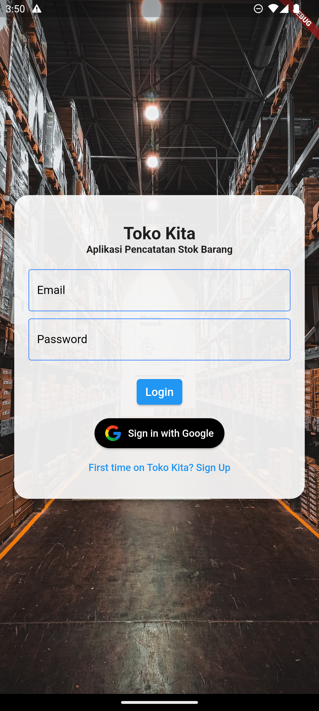
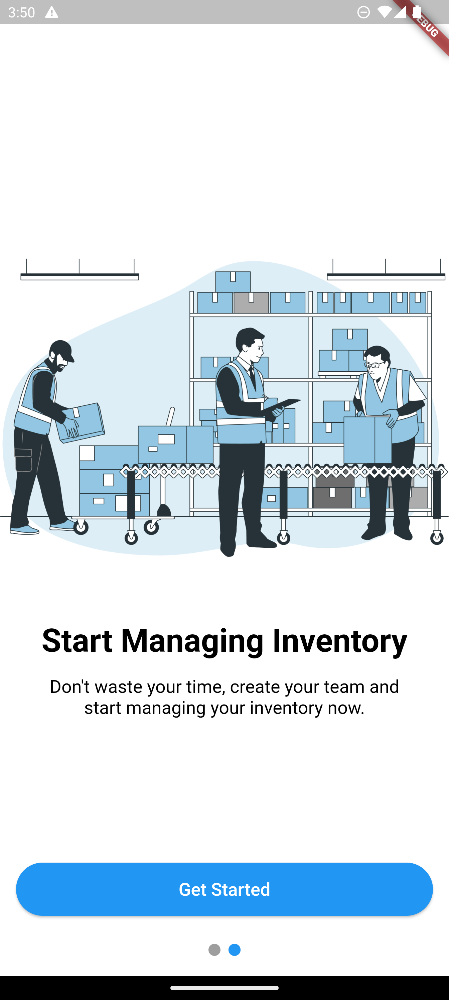
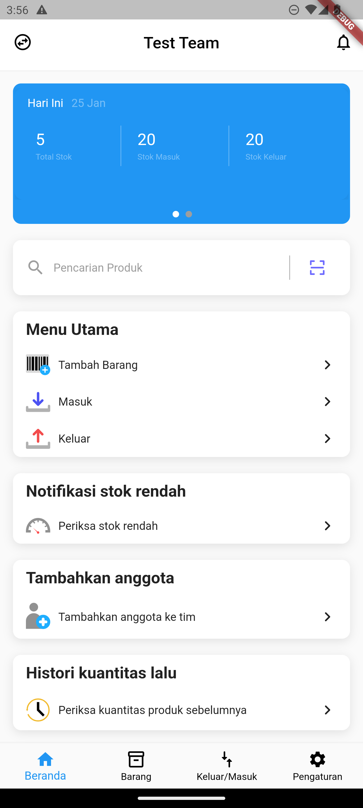
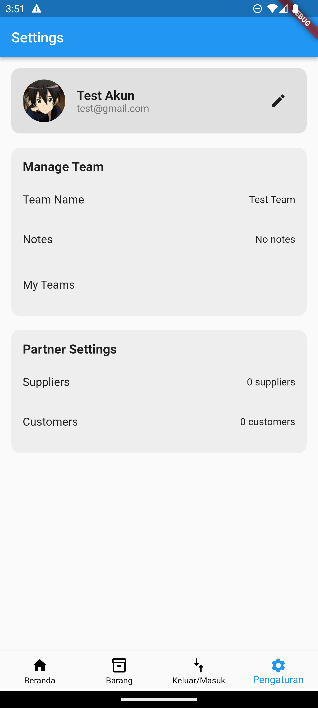
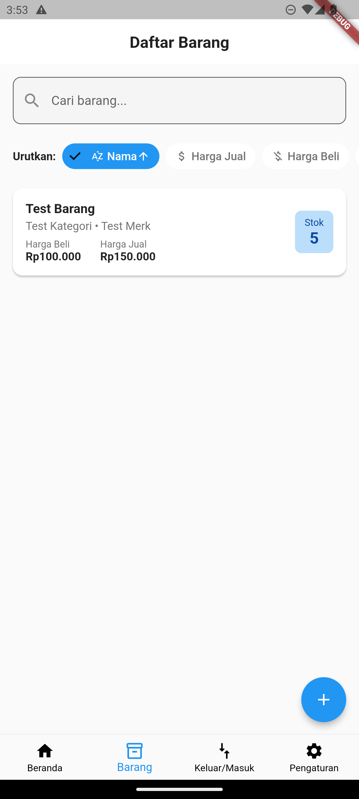
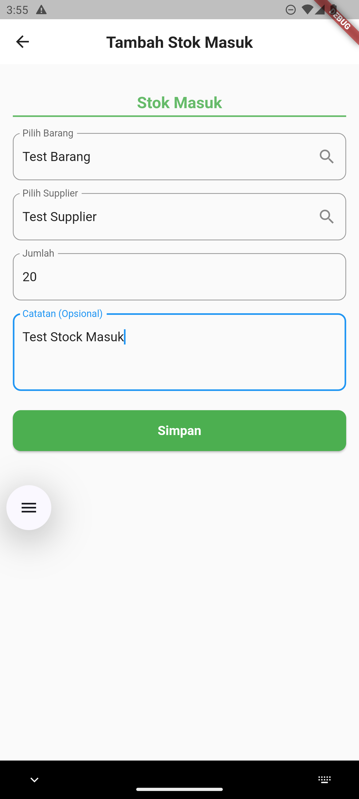
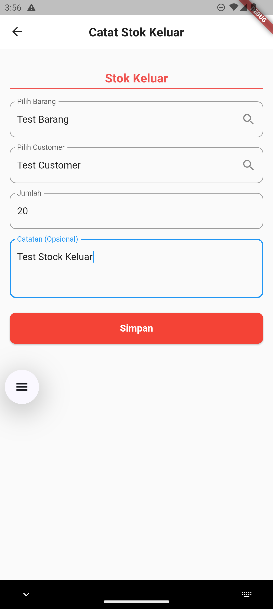
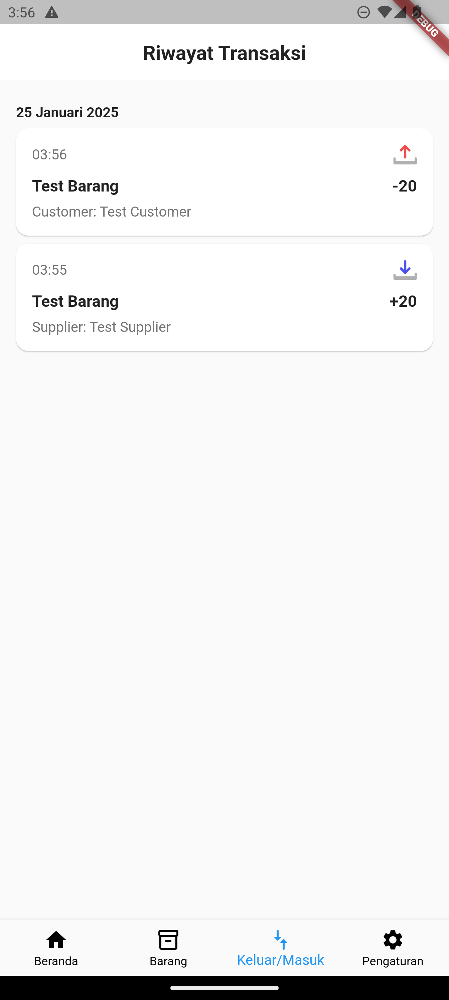

<div align="center">
  
  <h1>Toko Kita</h1>
  <p>Aplikasi manajemen inventori & penjualan untuk UMKM Indonesia</p>

  <a href="https://github.com/Velubby/tokokita_app/releases/tag/v1.0.0">
    
  </a>
  
  
  
</div>

---

## Tentang Aplikasi

**Toko Kita** adalah aplikasi manajemen inventori yang dikembangkan dengan Flutter, dirancang untuk membantu pemilik UMKM mengelola stok barang dan transaksi dengan mudah langsung dari smartphone.

## Fitur

- 📦 **Manajemen Produk** — Tambah, edit, hapus produk & tracking stok realtime
- 🔄 **Stok Masuk / Keluar** — Catat pergerakan stok dengan mudah
- 💸 **Transaksi** — Pencatatan penjualan & riwayat transaksi
- 🔔 **Notifikasi & Alarm Stok** — Peringatan stok menipis
- 🔐 **Autentikasi** — Google Sign-In & Email/Password
- 👥 **Multi-Tim** *(coming soon)* — Kelola toko bersama anggota tim
- 👤 **Manajemen Partner** *(coming soon)* — Data pelanggan & supplier

## Screenshots

<p align="center">
  
  
  
  
</p>

<p align="center">
  
  
  
  
</p>

## Download

Unduh APK terbaru dari [GitHub Releases](https://github.com/Velubby/tokokita_app/releases/tag/v1.0.0):

| Versi | Arsitektur | Ukuran | Cocok Untuk |
|---|---|---|---|
| [app-arm64-v8a](https://github.com/Velubby/tokokita_app/releases/download/v1.0.0/app-arm64-v8a-release.apk) | arm64-v8a | 22.6 MB | HP Android modern (64-bit) ⭐ Recommended |
| [app-armeabi-v7a](https://github.com/Velubby/tokokita_app/releases/download/v1.0.0/app-armeabi-v7a-release.apk) | armeabi-v7a | 20.3 MB | HP Android lama (32-bit) |
| [app-x86_64](https://github.com/Velubby/tokokita_app/releases/download/v1.0.0/app-x86_64-release.apk) | x86_64 | 24.0 MB | Emulator |

## Teknologi

| Teknologi | Keterangan |
|---|---|
| [Flutter](https://flutter.dev) 3.27+ | Framework UI cross-platform |
| [Firebase Auth](https://firebase.google.com/products/auth) | Autentikasi pengguna |
| [Cloud Firestore](https://firebase.google.com/products/firestore) | Database realtime |
| [Google Sign-In](https://pub.dev/packages/google_sign_in) | Login dengan akun Google |
| [Provider](https://pub.dev/packages/provider) | State management |
| [Google Fonts](https://pub.dev/packages/google_fonts) | Tipografi |

## Persyaratan

- Flutter SDK `3.27.0` atau lebih tinggi
- Dart `3.0.0` atau lebih tinggi
- Android Studio / VS Code
- Android SDK (minSdk 21 / Android 5.0+)
- Firebase project yang sudah dikonfigurasi

## Instalasi (untuk Developer)

1. **Clone repository**
```bash
git clone https://github.com/Velubby/tokokita_app.git
cd tokokita_app
```

2. **Install dependencies**
```bash
flutter pub get
```

3. **Konfigurasi Firebase**
   - Buat project di [Firebase Console](https://console.firebase.google.com)
   - Download `google-services.json` dan letakkan di `android/app/`
   - Aktifkan **Authentication** (Google Sign-In & Email/Password) dan **Cloud Firestore**

4. **Jalankan aplikasi**
```bash
flutter run
```

5. **Build release APK**
```bash
flutter build apk --release --split-per-abi
```

## Kontribusi

Kontribusi sangat diterima! Untuk perubahan besar, silakan buka **Issue** terlebih dahulu.

1. Fork repository ini
2. Buat branch fitur baru (`git checkout -b feat/fitur-baru`)
3. Commit perubahan (`git commit -m 'feat: tambah fitur baru'`)
4. Push ke branch (`git push origin feat/fitur-baru`)
5. Buat Pull Request

---

<div align="center">
  <p>Dibuat dengan ❤️ menggunakan Flutter</p>
</div>